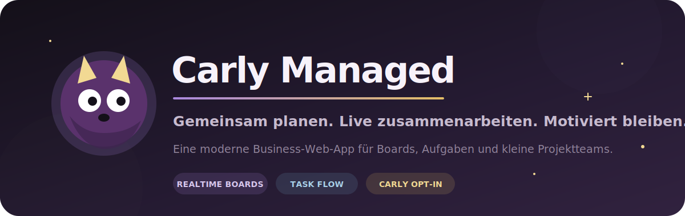
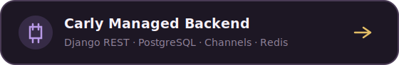

<p align="center">
  
</p>

<p align="center">
  <a href="https://github.com/benjaminBennewitz/Carly-Managed_BE">
    
  </a>
</p>

## Eine Business-App mit einer freundlichen Fassade

**Carly Managed** ist eine responsive Web-App für kollaboratives Task- und Projektmanagement. Sie richtet sich an Freelancer, Creator, junge Selbstständige und kleine Teams, die gemeinsam an übersichtlichen Boards arbeiten möchten.

Im Mittelpunkt stehen klare Arbeitsabläufe. Die optionale Figur Carly ergänzt das Produkt um Motivation, kleine Reaktionen und gemeinsame Erfolge, ohne das eigentliche Task-Management einzuschränken.

<table>
  <tr>
    <td width="50%">
      
    </td>
    <td width="50%">
      
    </td>
  </tr>
  <tr>
    <td width="50%">
      
    </td>
    <td width="50%">
      
    </td>
  </tr>
</table>

## Funktionsumfang

### Boards und Aufgaben

Gemeinsam nutzbare Boards bilden den Kern der Anwendung. Aufgaben lassen sich in einer Kanban- oder Listenansicht organisieren und erhalten alle Informationen, die für einen schnellen Arbeitsablauf notwendig sind.

Geplant sind unter anderem:

- persönliche und gemeinsam nutzbare Boards
- frei organisierbare Board-Spalten
- Kanban- und Listenansicht
- Drag-and-drop
- Titel, Beschreibung und Unteraufgaben
- Verantwortliche Personen
- Fälligkeiten, Prioritäten und Labels
- Kommentare, Erwähnungen und Anhänge
- Suche, Filter und Sortierung
- wiederkehrende Aufgaben
- regelbasierte Automatisierungen
- Archivierung und Wiederherstellung

### Zusammenarbeit in Echtzeit

Carly Managed soll nicht nur Daten synchronisieren, sondern gemeinsame Arbeit sichtbar machen.

Dazu gehören:

- Online-Präsenz auf einem Board
- Live-Mauszeiger eingeladener Personen
- sichtbare Task-Aktivitäten
- Bearbeitungshinweise
- kontrollierte gleichzeitige Änderungen
- Versionsprüfung gegen unbemerktes Überschreiben
- sofortige Aktualisierung verschobener und bearbeiteter Tasks

Dauerhafte Daten werden über eine REST-API verwaltet. Flüchtige Informationen wie Präsenz, Cursor und Live-Aktivitäten laufen ausschließlich über WebSockets.

### Inbox und Pool

Die Inbox sammelt Hinweise, Erwähnungen, Einladungen und relevante Board-Aktivitäten. Im Pool können Aufgaben bereitgestellt werden, die noch keiner bestimmten Person zugewiesen sind.

### Einladungen und Rollen

Boards können gezielt mit anderen Personen geteilt werden. Einladungen werden per sicherem Link oder E-Mail versendet und erhalten einen klaren Gültigkeitszeitraum.

Mitgliedschaften und Rollen steuern, wer ein Board ansehen, bearbeiten oder verwalten darf.

### Carly

Carly ist eine stilisierte magische Katze und ein vollständig optionales Motivationsmodul.

<p align="center">
  
</p>

Carly kann auf abgeschlossene Aufgaben, Inaktivität, überfällige Tasks und gemeinsame Erfolge reagieren. Im eigenen Carly-Bereich sind später Stimmung, Zuneigung, Streaks, Trophäen, Statistiken, Anpassungen und Entwicklungsstufen vorgesehen.

Optional kann Carly kleine Aufgaben wie Pausen oder kurze Interaktionen vorschlagen. Diese Aufgaben dürfen reguläre Arbeit weder blockieren noch künstlich verdrängen. Tageslimits, Cooldowns und serverseitige Prüfungen verhindern Task-Spam.

Spätere kooperative Aktionen können bewusst an die gleichzeitige Anwesenheit mehrerer Personen gekoppelt werden.

## Hauptnavigation

| Bereich | Aufgabe |
|---|---|
| Dashboard | Persönlicher Überblick, anstehende Aufgaben und kompakte Kennzahlen |
| Board | Kanban- und Listenansicht für Aufgaben und Projekte |
| Inbox | Einladungen, Erwähnungen und relevante Aktivitäten |
| Pool | Noch nicht fest zugewiesene Aufgaben |
| Carly | Optionaler Motivations- und Fortschrittsbereich |
| Einstellungen | Profil, Darstellung, Barrierefreiheit und App-Verhalten |

## Barrierefreiheit

Barrierefreiheit ist Bestandteil der Produktarchitektur und keine spätere Ergänzung.

Vorgesehen sind:

- vollständige Tastaturbedienung
- sichtbare Fokuszustände
- verständliche ARIA-Beschriftungen
- ausreichende Farbkontraste
- klar erkennbare Fehlerzustände
- ausreichend große Klickflächen
- reduzierte Animationen
- optional stärkerer Kontrast
- optional größere Schrift

## Technische Architektur

### Frontend

- Angular 21.2.19
- Standalone Components
- TypeScript
- SCSS
- Signals
- Angular CDK
- Vitest
- zoneless Angular
- Lazy Loading
- lokale Material Symbols

### Backend

- Django
- Django REST Framework
- PostgreSQL
- Django Channels
- Redis
- Daphne
- Celery für zeitgesteuerte Prozesse und Automatisierungen

[Backend-Repository öffnen](https://github.com/benjaminBennewitz/Carly-Managed_BE)

## Projektstatus

Das Projekt wird bewusst schrittweise neu aufgebaut. Bewährte Logik aus einer bestehenden Task-Management-Anwendung dient als fachliche Referenz, wird aber nicht unverändert übernommen.

Aktuell vorhanden:

- [x] Angular-21.2.19-Grundprojekt
- [x] Standalone- und Routing-Konfiguration
- [x] SCSS-Grundstruktur
- [x] Light- und Dark-Farbgrundlage
- [x] semantische Basistokens
- [x] lokale Asset-Struktur
- [ ] App-Shell und Hauptnavigation
- [ ] Authentifizierung
- [ ] Projekt- und Boardverwaltung
- [ ] Task-Management
- [ ] Realtime-Zusammenarbeit
- [ ] Inbox und Pool
- [ ] Carly-Modul

## Lokale Entwicklung

Abhängigkeiten installieren:

```cmd
npm install
```

Entwicklungsserver starten:

```cmd
npm start
```

Produktionsbuild prüfen:

```cmd
npm run build
```

Tests einmalig ausführen:

```cmd
npm test -- --run
```

Die lokale Anwendung ist standardmäßig unter `http://localhost:4200` erreichbar.

## Repositories

| Bereich | Repository |
|---|---|
| Frontend | Dieses Repository |
| Backend | [Carly-Managed_BE](https://github.com/benjaminBennewitz/Carly-Managed_BE) |
